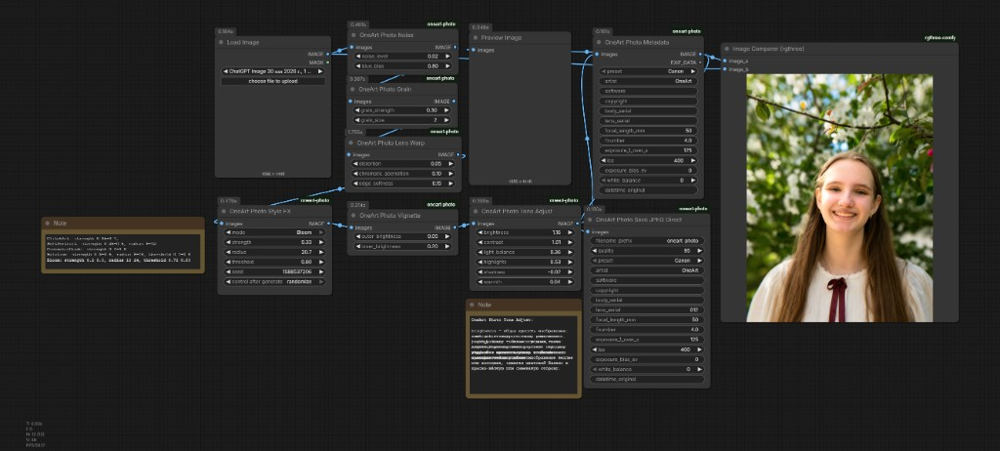
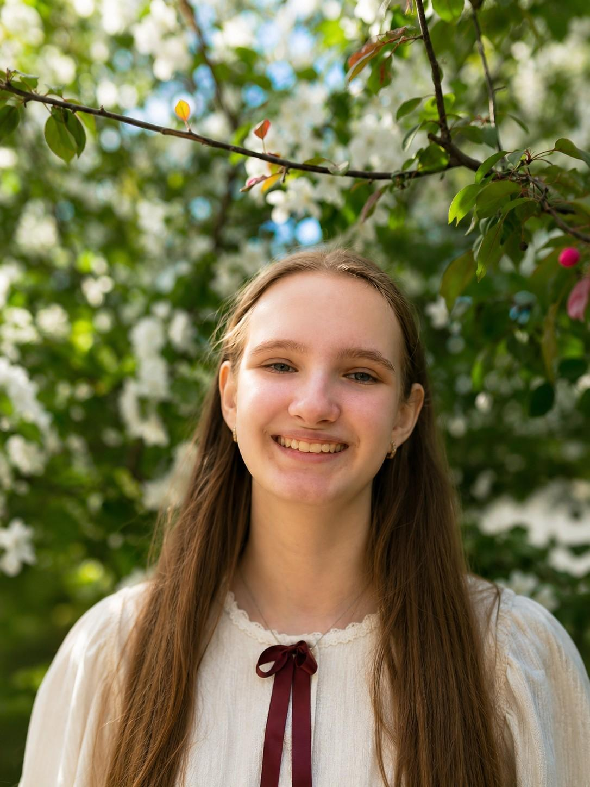
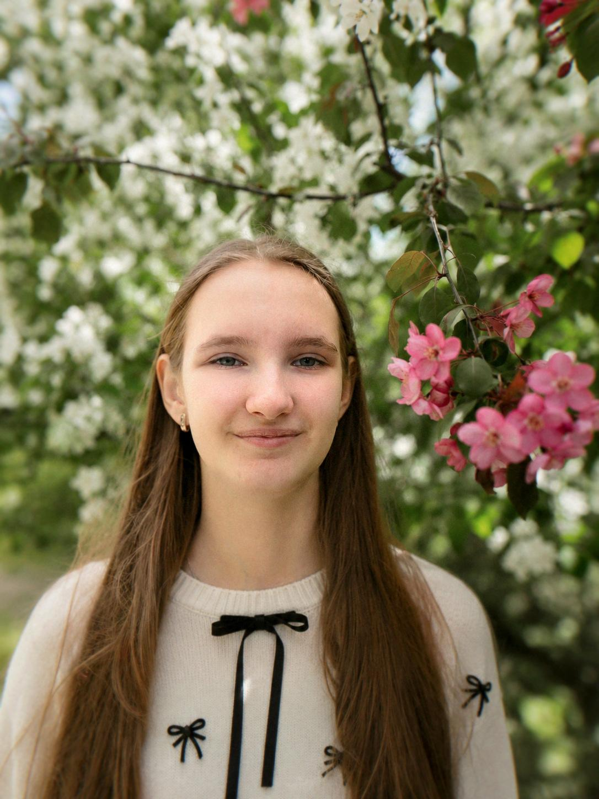
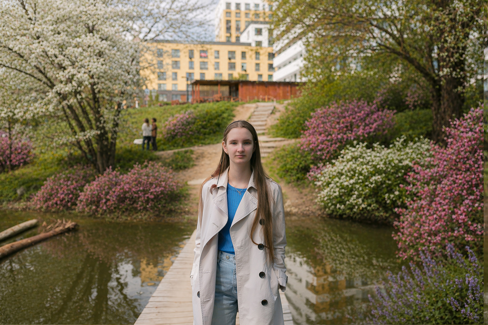

# OneArt Photo


<p align="center">
  
</p>

Professional photo finishing nodes for ComfyUI.

OneArt Photo is an open-source custom node pack that brings photography-inspired post-processing workflows to ComfyUI. It focuses on image finishing, metadata embedding, lens effects, LUT-based color grading, and camera-style transformations for AI-generated content.

Designed for creators, photographers, and workflow builders who want more control over the final visual look of generated images.

---

## ⚡ Features

### 🎞️ Photo Finishing Workflow
Add post-processing directly inside ComfyUI without leaving your generation pipeline.
* Lens distortion simulation
* Camera-style image transforms
* Creative photo presets
* LUT color grading workflows
* Metadata embedding

### 🎨 LUT Processing
Apply professional color grading workflows using LUTs.
* Cinematic looks
* Film-inspired color styles
* Consistent visual branding
* Reusable grading pipelines

### 📝 Metadata Injection
Store workflow information directly inside exported images.
* **Asset management:** Easily track settings and styles.
* **Workflow reproducibility:** Retrieve generation settings from exported files.
* **Production pipelines:** Automate indexing and categorization.
* **Dataset organization:** Standardize tags and camera profiles.

### 🔌 ComfyUI Native Integration
Built as native custom nodes for ComfyUI.
* Lightweight & modular
* Workflow-friendly
* Fully compatible with existing pipelines

---

## 🧩 Included Nodes

To keep the interface clean while supporting advanced features, OneArt Photo groups its physical nodes into four main modules:

| Module / Action | ComfyUI Node Class | Description |
| :--- | :--- | :--- |
| **Metadata Injection** | `OneArt Photo Metadata`<br>`OneArt Photo Save JPEG Direct` | Embeds EXIF metadata payloads (presets or overrides) directly into JPEGs. |
| **Lens Effects** | `OneArt Photo Lens Warp`<br>`OneArt Photo Vignette` | Simulates lens distortion coefficients and quadratic vignetting falloffs. |
| **LUT Processor** | `OneArt Photo LUT` | Applies `.cube` LUT color lookup tables with custom intensity blending. |
| **Photo Presets / Styles** | `OneArt Photo All In One`<br>`OneArt Photo Style FX`<br>`OneArt Photo Noise`<br>`OneArt Photo Grain`<br>`OneArt Photo Tone Adjust` | High-level presets (Bloom, Halation, Cinematic Grade, Soft Portrait), film grain, sensor noise, and fine-tuned tone curves. |
| **File I/O** | `OneArt Photo Load RAW / HEIC`<br>`OneArt Photo Save RAW` | Loads RAW / HEIC formats and saves uncompressed 16-bit DNG/TIFF files. |

---

## ⚙️ Installation

### Option 1: Via ComfyUI Manager
Search for **`OneArt Photo`** in the custom nodes catalog and click **Install**.

### Option 2: Manual Installation
1. Clone the repository into your ComfyUI `custom_nodes` folder:
   ```bash
   cd ComfyUI/custom_nodes
   git clone https://github.com/oneartai-lab/ComfyUI-oneart-photo.git
   ```
2. Install python dependencies:
   ```bash
   pip install -r requirements.txt
   ```
3. Restart ComfyUI.

---

## 🔄 Workflow Preview

Generation → Lens Effects → LUT Processing → Metadata Export → Final Image

<p align="center">
  
</p>

*You can find ready-to-use ComfyUI workflow JSON files in the [workflows/](workflows/) directory.*

---

## 🖼️ Example Results

OneArt Photo is built to give you precise control over your image aesthetics. Below are comparison pairs demonstrating different photographic transformations:

### Example 1: Analog Portrait Styling
*Applying skin smoothing (Soft Portrait), color warmth, vintage vignetting, LUT color grading, and organic sensor noise.*

| Original AI Output | OneArt Photo Processed |
| :---: | :---: |
|  |  |

### Example 2: Lens Aberration & Tone Adjust
*Applying lens warping, tone balance adjustments (shadows/highlights), and high-resolution procedural film grain.*

| Original AI Output | OneArt Photo Processed |
| :---: | :---: |
|  |  |

---

## 💡 Use Cases

### Portrait Enhancement
Add subtle photographic finishing, lens characteristics, and color grading to improve portrait realism.

### Social Media Content
Create consistent visual styles and color grading profiles across multiple generated images.

### Photography Simulation
Apply physics-based camera sensor noise and lens configurations to AI-generated outputs.

### Production Pipelines
Integrate finishing steps directly into automated, batch-processed ComfyUI workflows.

---

## ❓ Why OneArt Photo?

Most ComfyUI workflows focus on image generation.

OneArt Photo focuses on the final stage of the pipeline: photo finishing, visual consistency, metadata preservation, and camera-inspired rendering.

The goal is to make AI-generated images easier to bring to production quality without leaving ComfyUI.

---

## 🗺️ Project Roadmap

### v0.1
* Metadata injection
* Lens distortion
* LUT support
* Preset system

### v0.2
* Additional camera simulations
* Batch processing support
* Advanced metadata templates

### v0.3
* Film emulation workflows
* Extended finishing toolkit
* Creator workflow presets

---

## 🤝 Contributing

Issues, feature requests, pull requests, and workflow examples are welcome! If you build interesting workflows with OneArt Photo, feel free to share them in the issues or discussions.

---

## 📄 License

This project is licensed under the **MIT License** — see the [LICENSE](LICENSE) file for details.

---

## 💖 Acknowledgements

Built for the ComfyUI ecosystem and the open-source AI creator community.
